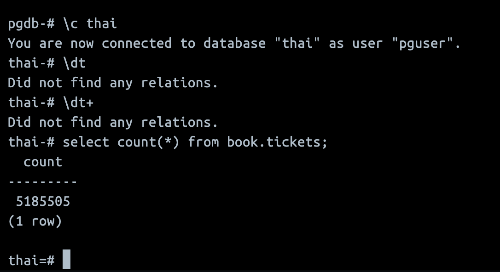

## Задание

1. Развернуть ВМ (Linux) с PostgreSQL (у вас есть ВМ в ВБ, любой другой способ, в т.ч.
докер)
2. Залить Тайские перевозки в минимальном варианте
https://github.com/aeuge/postgres16book/tree/main/database
3. Посчитать количество поездок - select count(*) from book.tickets;

## Выполнение
```
docker compose up -d

docker ps

psql -h localhost -U pguser -d pgdb

su postgres в контейнере
apt update
apt install wget

wget https://storage.googleapis.com/thaibus/thai_small.tar.gz && tar -xf thai_small.tar.gz && psql < thai.sql

psql -U pguser -d pgdb -f thai.sql

psql -U pguser -d pgdb

\l
```

`select count(*) from book.tickets;`

-- 5185505

[](img/1.png)